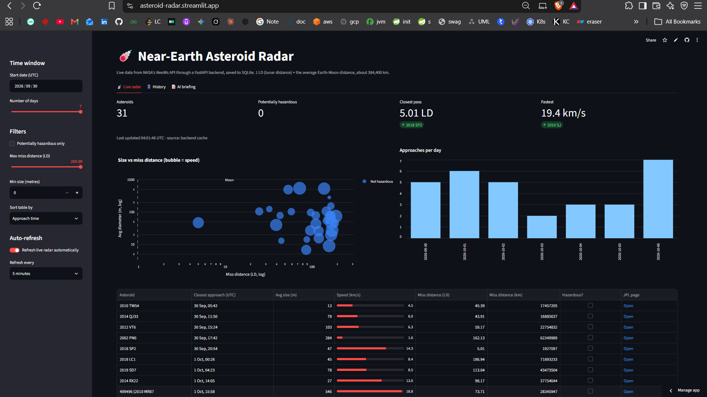
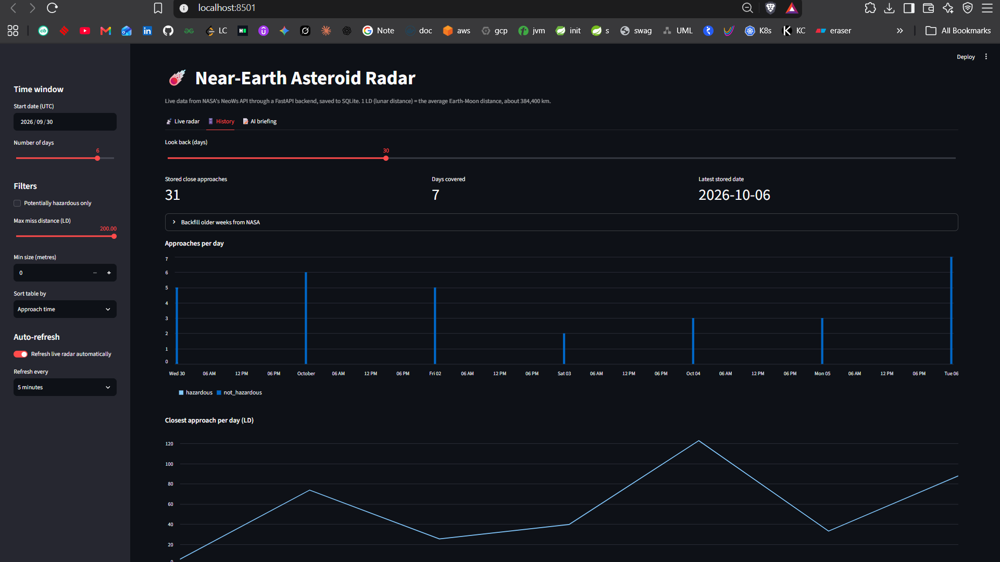
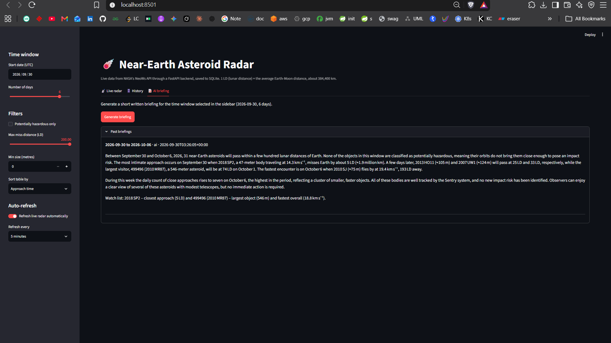

# Near-Earth Asteroid Radar AI Brief Project

A small FastAPI + Streamlit project that pulls live asteroid close-approach data
from NASA's NeoWs API, saves it to SQLite, and can write a weekly briefing.

> Live app: _add your `https://asteroid-radar.streamlit.app/`

## Contents

- [Features](#features)
- [Project layout](#project-layout)
- [Setup (Windows, PowerShell)](#setup-windows-powershell)
- [Run locally](#run-locally-two-terminals-both-from-the-project-folder)
- [Deploy to Streamlit Community Cloud](#deploy-to-streamlit-community-cloud)
- [API endpoints](#api-endpoints)
- [Tests](#tests)
- [Troubleshooting](#troubleshooting)
- [How it looks](#how-it-looks)

## Features

- **Live radar**: table, size-vs-distance bubble chart, per-day counts, sidebar filters,
  CSV download, and timed auto-refresh (`st.fragment(run_every=...)`)
- **History**: every fresh NASA fetch is stored in SQLite; view daily trends and
  backfill older weeks
- **AI briefing**: short written summary of the selected window, written by a Groq-hosted
  model when `GROQ_API_KEY` is set, otherwise a rule-based summary (no key needed)

## Project layout

```
near-earth-asteroid-radar-ai-brief-project/
  backend/
    main.py       FastAPI routes
    nasa.py       NASA client + 10-minute in-memory cache
    parsing.py    flattens NASA's nested JSON
    db.py         SQLite (asteroids + briefings tables)
    briefing.py   AI / rule-based briefing
  frontend/
    app.py        Streamlit UI
  tests/
    test_offline.py
  screenshots/    images used in this README
  data/           SQLite file is created here
  requirements.txt
  .env.example
```

## Setup (Windows, PowerShell)

```
python -m venv venv
venv\Scripts\activate
pip install -r requirements.txt
copy .env.example .env
```

Edit `.env` and set `NASA_API_KEY` (free at https://api.nasa.gov).
Optionally set `GROQ_API_KEY` (free at https://console.groq.com) for AI briefings.
Values in `.env` can be written with or without quotes; both work.

`GROQ_MODEL` must be a model that exists on Groq. The default is `openai/gpt-oss-20b`.
Groq's model list changes often, so check https://console.groq.com/docs/models.
Do not use OpenAI names such as `gpt-4o-mini`; Groq does not host them.

## Run locally (two terminals, both from the project folder)

```
# Terminal 1
uvicorn backend.main:app --reload

# Terminal 2
streamlit run frontend/app.py
```

Or double-click `run_backend.bat` and `run_frontend.bat`.

- App: http://localhost:8501
- API docs: http://127.0.0.1:8000/docs

If `streamlit` or `uvicorn` is "not recognized", activate the venv first
(`venv\Scripts\activate`) or run them through Python:
`python -m streamlit run frontend/app.py` and `python -m uvicorn backend.main:app --reload`.

## Deploy to Streamlit Community Cloud

Streamlit Community Cloud runs **one Streamlit app per deployment**; it cannot start a
separate FastAPI server. There are two ways to get the frontend and backend online.

### Option 1: single deployment (recommended)

The Streamlit app starts the FastAPI backend on a background thread inside the same
process. Only one app is deployed, and the API listens on `127.0.0.1`, so it is not
reachable from the internet.

**Step 1. Add the embedded backend to `frontend/app.py`**

Paste this right after the `st.set_page_config(...)` line:

```python
import sys, threading, time
from pathlib import Path

sys.path.insert(0, str(Path(__file__).resolve().parent.parent))  # so "backend" imports work


@st.cache_resource  # runs once per server process, not on every rerun
def start_embedded_backend():
    import uvicorn
    from backend.main import app as api_app

    server = uvicorn.Server(
        uvicorn.Config(api_app, host="127.0.0.1", port=8000, log_level="warning")
    )
    threading.Thread(target=server.run, daemon=True).start()
    for _ in range(50):  # wait up to ~10 seconds for it to come up
        try:
            requests.get("http://127.0.0.1:8000/health", timeout=1)
            return
        except requests.exceptions.RequestException:
            time.sleep(0.2)


if os.getenv("EMBED_BACKEND") == "1":  # only set on the cloud; local dev is unchanged
    start_embedded_backend()
```

The `EMBED_BACKEND` check means local development still uses the two-terminal setup above.

**Step 2. Push the project to GitHub**

Make sure `.env` is not committed (the `.gitignore` already excludes it).

```
git init
git add .
git commit -m "Near-Earth Asteroid Radar"
git branch -M main
git remote add origin https://github.com/YOUR_USER/YOUR_REPO.git
git push -u origin main
```

**Step 3. Create the app**

1. Go to https://share.streamlit.io and sign in with GitHub.
2. Click **Create app** and choose your repository and branch.
3. Set **Main file path** to `frontend/app.py`.
4. Keep `requirements.txt` in the repository root. Without one, only Streamlit is installed.

**Step 4. Add secrets**

Open **Advanced settings** and paste this into the **Secrets** box (TOML format),
using your own keys:

```toml
NASA_API_KEY = "your_nasa_key"
GROQ_API_KEY = "your_groq_key"
GROQ_MODEL = "openai/gpt-oss-20b"
EMBED_BACKEND = "1"
```

Top-level secrets are also exposed to the app as environment variables, so the existing
`os.getenv(...)` calls work without code changes. You can edit secrets later from the
app's settings. The same dialog has a Python version dropdown; the default (3.12) is fine.

**Step 5. Deploy**

Click **Deploy**. The first build takes a few minutes. After that, every `git push` to the
branch updates the app.

### Option 2: two deployments

Host the FastAPI backend on a service that runs Python servers (for example Render,
Railway, Fly.io, or a Hugging Face Docker Space; check each one's current free-tier terms).

Start command for the backend:

```
uvicorn backend.main:app --host 0.0.0.0 --port $PORT
```

Set `NASA_API_KEY` and `GROQ_API_KEY` as environment variables on that service. Then deploy
the Streamlit app on Community Cloud as in Option 1, but instead of `EMBED_BACKEND`, add:

```toml
API_URL = "https://your-backend.example.com"
```

The backend is public in this setup, so anyone who finds the URL can call `/briefing` or
`/backfill` and use up your NASA and Groq quotas. Add an API token check before sharing it.

### Deployment notes

- **History does not persist.** SQLite lives inside the app container, so the data resets
  when the app restarts, redeploys, or wakes from sleep. For durable history, switch to a
  hosted database (for example Neon, Supabase, or Turso).
- **Idle apps go to sleep.** The first visit after a quiet period is slow.
- **Use your own NASA key.** `DEMO_KEY` has a tiny quota and is shared across many users.
- **Option 1 is a workaround.** Running a second server inside a Streamlit app is not an
  officially supported pattern. If the app fails to start, check the logs in the
  Community Cloud dashboard (**Manage app**).
- **Never commit secrets.** Keys go in the Secrets box, not in the repository.

## API endpoints

| Method | Path | What it does |
|--------|------|--------------|
| GET | `/health` | status, whether DEMO_KEY / AI are in use |
| GET | `/asteroids?start_date=&days=` | asteroids for a window (max 7 days); saves fresh data |
| GET | `/history/daily?days=` | per-day summary from SQLite |
| GET | `/history/stats` | totals and date range stored |
| POST | `/backfill?weeks=` | fetch past weeks from NASA into SQLite |
| POST | `/briefing?start_date=&days=` | generate and save a briefing |
| GET | `/briefings?limit=` | past briefings |

## Tests

```
python -m unittest discover -s tests -v
```

These run offline and cover parsing, SQLite, and the rule-based briefing.

## Troubleshooting

- **429 from the backend**: NASA's DEMO_KEY quota is tiny. Use your own key in `.env`.
- **"Can't reach the FastAPI backend"**: start Terminal 1 first. On Streamlit Community Cloud,
  check that the `EMBED_BACKEND = "1"` secret is set and that Step 1 was added to `frontend/app.py`.
- **`ModuleNotFoundError: backend` on the cloud**: make sure the `sys.path.insert(...)` line from
  Step 1 is present and the **Main file path** is `frontend/app.py`.
- **Error about `width="stretch"`**: upgrade Streamlit (`pip install -U streamlit`).
- **AI briefing shows "rule-based"**: check `GROQ_API_KEY` and `GROQ_MODEL` in `.env`
  (or in the cloud Secrets box); the note under the briefing says why the AI call was
  skipped or failed.
- **Groq 429 / rate limit**: the free tier has per-minute limits. Wait a minute and retry.
- **Never share `.env`** or commit it to git (`.gitignore` already excludes it).
- "Potentially hazardous" is NASA's size-and-orbit category. It is not an impact prediction.

## How it looks find in:
https://asteroid-radar.streamlit.app/ 

- Live Radar



- History



- AI Briefing and generating projection of next week

